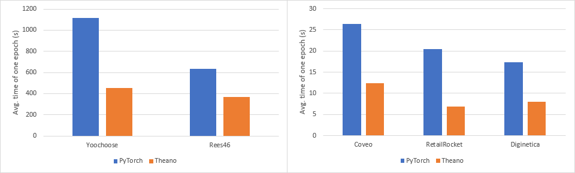
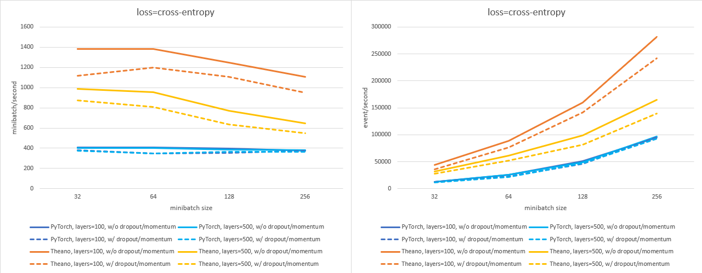
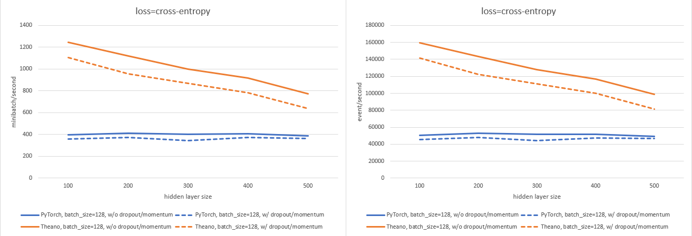
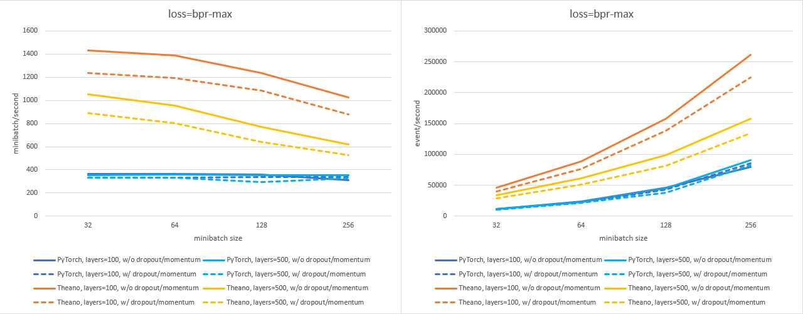
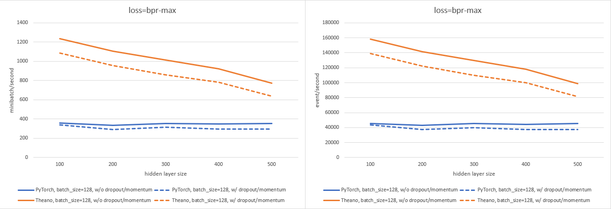

# Official PyTorch implementation of GRU4Rec
Official (re)implementation of the GRU4Rec [1,2] algorithm in **PyTorch**. The **original Theano** implementation is available at [https://github.com/hidasib/GRU4Rec](https://github.com/hidasib/GRU4Rec). If you are looking for the official **Tensorflow** (re)implementation, you can find it at [https://github.com/hidasib/GRU4Rec_Tensorflow_Official](https://github.com/hidasib/GRU4Rec_Tensorflow_Official).

Make sure to always use the latest version as baseline and cite [1,2] when you do so!

The purpose of this reimplementation is to provide an official version of the algorithm that is feature complete and has been validated against the original. We found that third party (unofficial) reimplementations lack many of the distinguishing features of GRU4Rec and contain serious implementation flaws and thus their performance - both in terms of recommendation accuracy and training times - is suboptimal [3].

[1] Balázs Hidasi, Alexandros Karatzoglou, Linas Baltrunas, Domonkos Tikk: [Session-based Recommendations with Recurrent Neural Networks](https://arxiv.org/abs/1511.06939), ICLR 2016  
[2] Balázs Hidasi, Alexandros Karatzoglou: [Recurrent Neural Networks with Top-k Gains for Session-based Recommendations](https://arxiv.org/abs/1706.03847), CIKM 2018  
[3] Balázs Hidasi, Ádám Czapp: [The Effect of Third Party Implementations on Reproducibility](https://arxiv.org/abs/2307.14956), RecSys 2023

**LICENSE:** Final license is coming soon! Meanwhile, use the [license of the original](https://github.com/hidasib/GRU4Rec/blob/master/license.txt), i.e. free for research and education, but contact me for commercial use.

**CONTENTS:**  
[Differences to the original](#differences-to-the-original "Differences to the original")  
  [Removed hyperparameters/settings](#removed-hyperparameterssettings "Removed hyperparameters/settings")  
  [Changed hyperparameters/settings](#changed-hyperparameterssettings "Changed hyperparameters/settings")  
[Speed of training](#speed-of-training "Speed of training")  
  [Training time comparison](#training-time-comparison "Training time comparison")  
[Usage](#usage "Usage")  
  [Examples](#examples "Examples")  
  [Notes on sequence-aware and session-based models](#notes-on-sequence-aware-and-session-based-models "Notes on sequence-aware and session-based models")  
[Reproducing results on public datasets](#reproducing-results-on-public-datasets "Reproducing results on public datasets")  
[Hyperparameter tuning](#hyperparameter-tuning "Hyperparameter tuning")  
[Major updates](#major-updates "Major updates")  

## Differences to the original
There are a few differences between the original and the PyTorch version.

### Removed hyperparameters/settings
The original Theano implementation has a lot of setting options, however some of those were used only during the early days of the research (2015-2016) and their default value is considered to be the best option. To simplify the code, the following options have been removed:

| Option             | Defaults to | Effect                                                                                                               |
|--------------------|:-----------:|----------------------------------------------------------------------------------------------------------------------|
| `hidden_act`         |    `tanh`     | The activation function of the hidden layer is always tanh.                                                          |
| `lmbd`               |     `0.0`     | L2 regularization is disabled, use dropout for regularization.                                                       |
| `smoothing`          |     `0.0`     | Label smoothing for cross-entropy loss is removed as it had only a minor impact on performance.                      |
| `adapt`              |   `adagrad`   | The oprimizer defaults to Adagrad (with Nesterov's momentum). Other optimizers might come back in the future.        |
| `adapt_params`       |     `[]`      | Adagrad has no hyperparameters, therefore this is no longer needed.                                                  |
| `grad_cap`           |     `0.0`     | Training works fine without gradient capping/clipping, option removed.                                               |
| `sigma`              |     `0.0`     | Setting the min/max value during weight initialization is no longer supported, `±sqrt(6.0/(dim[0] + dim[1]))` is used. |
| `init_as_normal`     |    `False`    | Weights are always initialized from uniform distribution.                                                            |
| `train_random_order` |    `False`    | Training sessions can not be shuffled.                                                                               |
| `time_sort`          |    `True`     | Training sessions are sorted in ascending order by the timestamp of their first event (oldest session first).        |

### Changed hyperparameters/settings
The original implementation supports 4 losses, of which 2 are clearly superior. These losses are very different and work with different final activation functions. To make it harder to make mistakes here, the following changes have been made:
- The `loss` hyperparameter can be only set to *cross-entropy* or *bpr-max* that result in GRU4Rec using the *cross-entropy loss over a softmax* final activation or the *BPR-max loss over ELU or linear* final activation respectively.
- Since selecting the loss now determines the final activation (sort of), the `final_act` hyperparameter has been removed.
- Instead, setting the parameter of the ELU (with BPR-Max loss) can be done through the `elu_param` parameter. Setting it to 0 makes it use linear activation instead (i.e. disables the ELU). Other options (e.g. RELU) are no longer possible, but might come back in the future.

## Speed of training
Due to the differences between Theano and PyTorch, as well as the nature of GRU4Rec, you can experience a significant slowdown when switching to the PyTorch code. The difference is larger if the layer and/or minibatch size is *lower*. If you need cutting edge performance, give the Theano code a try. Even though Theano has been discontinued for several years, it still works perfectly fine, even with newer CUDA versions. Just make sure to follow to read the description of the original GRU4Rec carefully.

*Details:* The short version is that Theano requires you to build a computational graph and then a Theano function needs to be created that does the computations described by the graph. During the creation of the function, the code is complied into a single (or sometimes more) C++/CUDA executables which are executed every time you call the function from Python. If you don't use any Python based operators, control doesn't need to be given back to Python which significantly lowers the overhead. The published version of GRU4Rec works on ID based representations and thus a single minibatch usually can't max out the GPU. Therefore, having the overhead of passing control between C++/CUDA and Python can significantly increase training times. This is why the difference is smaller if the layer and/or minibatch size is higher. But optimal performance sometimes requires smaller minibatches.

Further optimization on this code might be also possible, however it is already faster than publicly available third-party reimplementations.

PyTorch2 supports compilation that is supposed to eliminate the problem, however it does not seem to work with sparse embeddings and those are crucial here (and in any other model, where the number of embedded entities is significantly more than its portion used in a minibatch).

### Training time comparison
Time to complete one epoch (in seconds) on publicly available datasets with the best parameterization (see below), measured on an nVidia A30. The Theano version is 1.7-3 times faster.  The PyTorch implementation is on par with the Tensorflow version w.r.t. speed.


The following figures show the difference between training speed (minibatch/second & event/second; higher is better) for various minibatch and layer sizes with and without dropout and momentum enabled, using `n_sample=2048`. Measured on an nVidia A30.

With `cross-entropy` loss:





With `bpr-max` loss:





The Theano version is 1.5-4x times faster depending on the settings. The figures also confirm that the difference is due to the larger overhead of PyTorch.

## Usage
`run.py` is an easy way to train, evaluate and save/load GRU4Rec models.

Execute with the `-h` argument to take a look at the parameters.

```
$ python run.py -h
```

Output:
```
usage: run.py [-h] [-ps PARAM_STRING] [-pf PARAM_PATH] [-l] [-s MODEL_PATH] [-t TEST_PATH [TEST_PATH ...]] [-m AT [AT ...]] [-e EVAL_TYPE] [-ss SS] [-g GRFILE] [-d DEVICE] [-ik IK] [-sk SK] [-tk TK] [-pm METRIC] [-lpm] PATH

Train or load a GRU4Rec model & measure recall and MRR on the specified test set(s).

positional arguments:
  PATH                  Path to the training data (TAB separated file (.tsv or .txt) or pickled pandas.DataFrame object (.pickle)) (if the --load_model parameter is NOT provided) or to the serialized model (if the --load_model parameter
                        is provided).

optional arguments:
  -h, --help            show this help message and exit
  -ps PARAM_STRING, --parameter_string PARAM_STRING
                        Training parameters provided as a single parameter string. The format of the string is `param_name1=param_value1,param_name2=param_value2...`, e.g.: `loss=bpr-max,layers=100,constrained_embedding=True`. Boolean
                        training parameters should be either True or False; parameters that can take a list should use / as the separator (e.g. layers=200/200). Mutually exclusive with the -pf (--parameter_file) and the -l (--load_model)
                        arguments and one of the three must be provided.
  -pf PARAM_PATH, --parameter_file PARAM_PATH
                        Alternatively, training parameters can be set using a config file specified in this argument. The config file must contain a single OrderedDict named `gru4rec_params`. The parameters must have the appropriate type
                        (e.g. layers = [100]). Mutually exclusive with the -ps (--parameter_string) and the -l (--load_model) arguments and one of the three must be provided.
  -l, --load_model      Load an already trained model instead of training a model. Mutually exclusive with the -ps (--parameter_string) and the -pf (--parameter_file) arguments and one of the three must be provided.
  -s MODEL_PATH, --save_model MODEL_PATH
                        Save the trained model to the MODEL_PATH. (Default: don't save model)
  -t TEST_PATH [TEST_PATH ...], --test TEST_PATH [TEST_PATH ...]
                        Path to the test data set(s) located at TEST_PATH. Multiple test sets can be provided (separate with spaces). (Default: don't evaluate the model)
  -m AT [AT ...], --measure AT [AT ...]
                        Measure recall & MRR at the defined recommendation list length(s). Multiple values can be provided. (Default: 20)
  -e EVAL_TYPE, --eval_type EVAL_TYPE
                        Sets how to handle if multiple items in the ranked list have the same prediction score (which is usually due to saturation or an error). See the documentation of batch_eval() in evaluation.py for further details.
                        (Default: standard)
  -ss SS, --sample_store_size SS
                        GRU4Rec uses a buffer for negative samples during training to maximize GPU utilization. This parameter sets the buffer length. Lower values require more frequent recomputation, higher values use more (GPU) memory.
                        Unless you know what you are doing, you shouldn't mess with this parameter. (Default: 10000000)
  -g GRFILE, --gru4rec_model GRFILE
                        Name of the file containing the GRU4Rec class. Can be used to select different varaiants. (Default: gru4rec_pytorch)
  -d DEVICE, --device DEVICE
                        Device used for computations (default: cuda:0).
  -ik IK, --item_key IK
                        Column name corresponding to the item IDs (detault: ItemId).
  -sk SK, --session_key SK
                        Column name corresponding to the session IDs (default: SessionId).
  -tk TK, --time_key TK
                        Column name corresponding to the timestamp (default: Time).
  -pm METRIC, --primary_metric METRIC
                        Set primary metric, recall or mrr (e.g. for paropt). (Default: recall)
  -lpm, --log_primary_metric
                        If provided, evaluation will log the value of the primary metric at the end of the run. Only works with one test file and list length.

```

### Examples
Train and evaluate a model measuring recall and MRR at 1, 5, 10 and 20 using model parameters from a parameter string.
```
python run.py /path/to/training_data_file -t /path/to/test_data_file -m 1 5 10 20 -ps layers=224,batch_size=80,dropout_p_embed=0.5,dropout_p_hidden=0.05,learning_rate=0.05,momentum=0.4,n_sample=2048,sample_alpha=0.4,bpreg=1.95,logq=0.0,loss=bpr-max,constrained_embedding=True,elu_param=0.5,n_epochs=10 -d cuda:0 -s /path/to/save_model.pt
```
Output (on the RetailRocket dataset):
```
Creating GRU4Rec model on device "cuda:0"
SET   layers                  TO   [224]     (type: <class 'list'>)
SET   batch_size              TO   80        (type: <class 'int'>)
SET   dropout_p_embed         TO   0.5       (type: <class 'float'>)
SET   dropout_p_hidden        TO   0.05      (type: <class 'float'>)
SET   learning_rate           TO   0.05      (type: <class 'float'>)
SET   momentum                TO   0.4       (type: <class 'float'>)
SET   n_sample                TO   2048      (type: <class 'int'>)
SET   sample_alpha            TO   0.4       (type: <class 'float'>)
SET   bpreg                   TO   1.95      (type: <class 'float'>)
SET   logq                    TO   0.0       (type: <class 'float'>)
SET   loss                    TO   bpr-max   (type: <class 'str'>)
SET   constrained_embedding   TO   True      (type: <class 'bool'>)
SET   elu_param               TO   0.5       (type: <class 'float'>)
SET   n_epochs                TO   10        (type: <class 'int'>)
Loading training data...
Loading data from TAB separated file: /path/to/training_data_file
Started training
The dataframe is already sorted by SessionId, Time
Created sample store with 4882 batches of samples (type=GPU)
Epoch1 --> loss: 0.483303       (24.57s)        [284.68 mb/s | 22568 e/s]
Epoch2 --> loss: 0.381012       (21.87s)        [319.82 mb/s | 25353 e/s]
Epoch3 --> loss: 0.353122       (21.87s)        [319.88 mb/s | 25358 e/s]
Epoch4 --> loss: 0.339082       (25.33s)        [276.19 mb/s | 21895 e/s]
Epoch5 --> loss: 0.329855       (21.76s)        [321.56 mb/s | 25491 e/s]
Epoch6 --> loss: 0.323511       (21.70s)        [322.36 mb/s | 25554 e/s]
Epoch7 --> loss: 0.318501       (21.62s)        [323.60 mb/s | 25653 e/s]
Epoch8 --> loss: 0.314374       (21.52s)        [325.16 mb/s | 25776 e/s]
Epoch9 --> loss: 0.311090       (21.93s)        [319.08 mb/s | 25294 e/s]
Epoch10 --> loss: 0.308339      (21.64s)        [323.23 mb/s | 25624 e/s]
Total training time: 226.73s
Loading test data...
Loading data from TAB separated file:  /path/to/test_data_file
Starting evaluation (cut-off=[1, 5, 10, 20], using conservative mode for tiebreaking)
Using existing item ID map
The dataframe is already sorted by SessionId, Time
Evaluation took 0.49s
Recall@1: 0.125334 MRR@1: 0.125334
Recall@5: 0.322738 MRR@5: 0.196280
Recall@10: 0.421153 MRR@10: 0.209505
Recall@20: 0.519616 MRR@20: 0.216372

```

Train on `cuda:0` and save using model parameters from a parameter file.
```
python run.py /path/to/training_data_file -pf /path/to/parameter_file.py -s /path/to/save_model.pt -d cuda:0
```
Output (on the RetailRocket dataset):
```
Creating GRU4Rec model on device "cuda:0"
SET   layers                  TO   [224]     (type: <class 'list'>)
SET   batch_size              TO   80        (type: <class 'int'>)
SET   dropout_p_embed         TO   0.5       (type: <class 'float'>)
SET   dropout_p_hidden        TO   0.05      (type: <class 'float'>)
SET   learning_rate           TO   0.05      (type: <class 'float'>)
SET   momentum                TO   0.4       (type: <class 'float'>)
SET   n_sample                TO   2048      (type: <class 'int'>)
SET   sample_alpha            TO   0.4       (type: <class 'float'>)
SET   bpreg                   TO   1.95      (type: <class 'float'>)
SET   logq                    TO   0.0       (type: <class 'float'>)
SET   loss                    TO   bpr-max   (type: <class 'str'>)
SET   constrained_embedding   TO   True      (type: <class 'bool'>)
SET   elu_param               TO   0.5       (type: <class 'float'>)
SET   n_epochs                TO   10        (type: <class 'int'>)
Loading training data...
Loading data from TAB separated file: /path/to/training_data_file
Started training
The dataframe is already sorted by SessionId, Time
Created sample store with 4882 batches of samples (type=GPU)
Epoch1 --> loss: 0.483303       (24.57s)        [284.68 mb/s | 22568 e/s]
Epoch2 --> loss: 0.381012       (21.87s)        [319.82 mb/s | 25353 e/s]
Epoch3 --> loss: 0.353122       (21.87s)        [319.88 mb/s | 25358 e/s]
Epoch4 --> loss: 0.339082       (25.33s)        [276.19 mb/s | 21895 e/s]
Epoch5 --> loss: 0.329855       (21.76s)        [321.56 mb/s | 25491 e/s]
Epoch6 --> loss: 0.323511       (21.70s)        [322.36 mb/s | 25554 e/s]
Epoch7 --> loss: 0.318501       (21.62s)        [323.60 mb/s | 25653 e/s]
Epoch8 --> loss: 0.314374       (21.52s)        [325.16 mb/s | 25776 e/s]
Epoch9 --> loss: 0.311090       (21.93s)        [319.08 mb/s | 25294 e/s]
Epoch10 --> loss: 0.308339      (21.64s)        [323.23 mb/s | 25624 e/s]
Total training time: 226.73s
Saving trained model to: /path/to/save_model.pt
```
Load a previously trained model to `cuda:1` and evaluate it measuring recall and MRR at 1, 5, 10 and 20 using the conservative method for tiebreaking.
```
 python run.py /path/to/save_model.pt -l -t /path/to/test_data_file -m 1 5 10 20 -e conservative -d cuda:1
```
Output (on the RetailRocket dataset):
```
Loading trained model from file: /path/to/save_model.pt (to device "cuda:1")
Loading test data...
Loading data from TAB separated file: /path/to/test_data_file
Starting evaluation (cut-off=[1, 5, 10, 20], using conservative mode for tiebreaking)
Using existing item ID map
The dataframe is already sorted by SessionId, Time
Evaluation took 1.31s
Recall@1: 0.125334 MRR@1: 0.125334
Recall@5: 0.322738 MRR@5: 0.196280
Recall@10: 0.421153 MRR@10: 0.209505
Recall@20: 0.519616 MRR@20: 0.216372

```

### Notes on sequence-aware and session-based models
GRU4Rec is originally for session-based recommendations, where the generally short sessions are considered independent. Every time a user comes to the site, they are considered to be unknown, i.e. nothing of their history is used, even if it is known. (This setup is great for many real-life applications.) This means that when the model is evaluated, the hidden state starts from zero for each test session.

However, RNN (CNN, Transformer, etc.) based models are also a great fit for the practically less important sequence-aware personalized recommendation setup (i.e. the whole user history is used as a sequence to predict future items in the sequence). There are two main differences: 
- (1) The sequences are significantly longer in sequence-aware recommendations. This also means that BPTT (backpropagation through time) is useful in this scenario. For session-based recommendations, experiments suggest that BPTT doesn't improve the model.
- (2) Evaluation in the sequence-aware setup should be started from the last value of the hidden state (i.e. the value computed on the training portion of the user history).

Currently, neither of these are supported in the public code. These functionalities might be added later if there is enough interewst from the community (they exist in some of my internal research repos). At the moment, you have to extend the code yourself to do this.

## Reproducing results on public datasets
The performance of GRU4Rec has been measured on multiple public datasets in [1,2,3,4]: Yoochoose/RSC15, Rees46, Coveo, RetailRocket and Diginetica.

*IMPORTANT:* Measuring performance of sequential recommenders makes sense only if the data (and the task) itself shows sequential patterns, e.g. session based data. Evaluation on rating data doesn't give informative results. See [4] for details as well as for other common flaws people do during evaluation of sequential recommenders.

**Notes:**  
- Always aim to include at least one realistically large dataset in your comparison (e.g. Rees46 is a good example).
- The evaluation setup is described in detail in [1,2,3]. It is a next-item prediction type evaluation considering only the next item as relevant for a given inference. This is a good setup for behaviour prediction and correlates somewhat with online performance. It is a stricter setup than considering any of the subsequent items as relevant, which - while a perfecly reasonable setup - is more forgiving towards simplistic (e.g. counting based) methods. However, similarly to any other offline evaluation it is not a direct approximation of online performance.

**Getting the data:** Please refer to the original source of the data to obtain a full and legal copy. Links here are provided as best effort. It is not guaranteed that they won't break over time.
- [Yoochoose/RSC15](https://2015.recsyschallenge.com) or ([reupload on Kaggle](https://www.kaggle.com/datasets/chadgostopp/recsys-challenge-2015))
- [Rees46](https://www.kaggle.com/datasets/mkechinov/ecommerce-behavior-data-from-multi-category-store)
- [Coveo](https://github.com/coveooss/shopper-intent-prediction-nature-2020)
- [RetailRocket](https://www.kaggle.com/datasets/retailrocket/ecommerce-dataset)
- [Diginetica](https://competitions.codalab.org/competitions/11161#learn_the_details-data2)

**Preprocessing:**  
The details and the reasoning behind the preprocessing steps can be found in [1,2] for RSC15 and in [3] for Yoochoose, Rees46, Coveo, RetailRocket and Diginetica. Preprocessing script for RSC15 can be found in the [original implementation's repo](https://github.com/hidasib/GRU4Rec/blob/master/examples/rsc15/preprocess.py), and in [the repo corresponding to [3]](https://github.com/hidasib/gru4rec_third_party_comparison) for Yoochoose, Rees46, Coveo, RetailRocket and Diginetica. After running the scripts, double check if the statistics of the resulting sets match what is reported in the papers.

Preprocessing scripts yield 4 files per dataset:
- `train_full` --> full training set, used for training the model for the final evaluation 
- `test` --> test set for the final evaluation of the model (the pair of `train_full`)
- `train_tr` --> training set for hyperparameter optimization, experimentation
- `train_valid` --> validation set for hyperparameter optimization, experimentation (the pair of `train_tr`)

Basically, the full preprocessed dataset is split into `train_full` and `test`, then `train_full` is split into `train_tr` and `train_valid` using the same logic.

*IMPORTANT:* Note that while RSC15 and Yoochoose is derived from the same source (Yoochoose dataset), the preprocessing is different. The main difference is that RSC15 doesn't use deduplication. Therefore results on the two datasets are not compareable and optimal hyperparameters might differ. It is recommended to use the Yoochoose version and rely on the RSC15 version only when comparing to previously reported results if the experiment can't be reproduced for some reason (e.g. implementation of the method is not available).

[1] Balázs Hidasi, Alexandros Karatzoglou, Linas Baltrunas, Domonkos Tikk: [Session-based Recommendations with Recurrent Neural Networks](https://arxiv.org/abs/1511.06939), ICLR 2016  
[2] Balázs Hidasi, Alexandros Karatzoglou: [Recurrent Neural Networks with Top-k Gains for Session-based Recommendations](https://arxiv.org/abs/1706.03847), CIKM 2018  
[3] Balázs Hidasi, Ádám Czapp: [The Effect of Third Party Implementations on Reproducibility](https://arxiv.org/abs/2307.14956), RecSys 2023  
[4] Balázs Hidasi, Ádám Czapp: [Widespread Flaws in Offline Evaluation of Recommender Systems](https://arxiv.org/abs/2307.14951), RecSys 2023

**Hyperparameters:**  
Hyperparameters for RSC15 were obtained using a local (star) search optimizer with restarting when a better parameterization is found. It used a smaller parameter space than what is included in this repo (e.g. hidden layer size was fixed to 100). Probably there is room for some small potential improvement here with the new Optuna based optimizer.

Hyperparameters for Yoochoose, Rees46, Coveo, RetailRocket and Diginetica were obtained using the parameter spaces uploaded to this repo. 200 runs were executed per dataset, per embedding mode (no embedding, separate embedding, shared embedding) and per loss function (cross-entropy, bpr-max). The primary metric was MRR@20 that usually also gave the best results wrt. recall@20. A separate training/validation set was used during parameter optimization that was created from the full training set the same way as the (full) training/test split was created from the full dataset. Final results are measured on the test set with models trained on the full training set.

**Best hyperparameters:**  
*Note:* Parameter files (usable with the `-pf` argument of `run.py`) are [included](https://github.com/hidasib/GRU4Rec_PyTorch_Official/tree/master/paramfiles) in this repo for convenience.

| Dataset | loss | constrained_embedding | embedding | elu_param | layers | batch_size | dropout_p_embed | dropout_p_hidden | learning_rate | momentum | n_sample | sample_alpha | bpreg | logq |
|---|---|---|---|---|---|---|---|---|---|---|---|---|---|---|
| RSC15 | cross-entropy | True | 0 | 0 | 100 | 32 | 0.1 | 0 | 0.1 | 0 | 2048 | 0.75 | 0 | 1 |
| Yoochoose | cross-entropy | True | 0 | 0 | 480 | 48 | 0 | 0.2 | 0.07 | 0 | 2048 | 0.2 | 0 | 1 |
| Rees46 | cross-entropy | True | 0 | 0 | 512 | 240 | 0.45 | 0 | 0.065 | 0 | 2048 | 0.5 | 0 | 1 |
| Coveo | bpr-max | True | 0 | 1 | 512 | 144 | 0.35 | 0 | 0.05 | 0.4 | 2048 | 0.2 | 1.85 | 0 |
| RetailRocket | bpr-max | True | 0 | 0.5 | 224 | 80 | 0.5 | 0.05 | 0.05 | 0.4 | 2048 | 0.4 | 1.95 | 0 |
| Diginetica | bpr-max | True | 0 | 1 | 512 | 128 | 0.5 | 0.3 | 0.05 | 0.15 | 2048 | 0.3 | 0.9 | 0 |

**Results:**  
*Note:* Due to the changes in the order of the executions of operations on the GPU, some slight variation (even up to a few percent) in the metrics is expected and acceptable.

| Dataset | Recall@1 | MRR@1 | Recall@5 | MRR@5 | Recall@10 | MRR@10 | Recall@20 | MRR@20 |
|---|---|---|---|---|---|---|---|---|
| RSC15 | 0.1845 | 0.1845 | 0.4906 | 0.2954 | 0.6218 | 0.3130 | 0.7283 | 0.3205 |
| Yoochoose | 0.1829 | 0.1829 | 0.4478 | 0.2783 | 0.5715 | 0.2949 | 0.6789 | 0.3024 |
| Rees46 | 0.1114 | 0.1114 | 0.3010 | 0.1778 | 0.4135 | 0.1928 | 0.5293 | 0.2008 |
| Coveo | 0.0513 | 0.0513 | 0.1496 | 0.0852 | 0.2212 | 0.0946 | 0.3135 | 0.1010 |
| ReatilRocket |  0.1274 | 0.1274 | 0.3237 | 0.1977 | 0.4207 | 0.2107 | 0.5186 | 0.2175 |
| Diginetica | 0.0725 | 0.0725 | 0.2369 | 0.1288 | 0.3542 | 0.1442 | 0.4995 | 0.1542 |


## Hyperparameter tuning
Hyperparameter optimization on new datasets is supported by `paropt.py`. Internally it uses [Optuna](https://optuna.org/) and requires a defined parameter space. A few predefined parameter spaces are [included](https://github.com/hidasib/GRU4Rec_PyTorch_Official/tree/master/paramspaces) in this repo.

**Recommendations:**
- Run between 100 and 200 iterations with the included parameter spaces.
- Run separate optimizations when using different losses and embedding modes (no embedding (i.e. `embedding=0,constrained_embedding=False`), separate embedding (i.e. `embedding=layersize,constrained_embedding=False`) and shared embedding (i.e. `embedding=0,constrained_embedding=True`)).

**Fixed parameters:** You can play around with these as well in the optimizer, however the following fixed settings have worked well in the past.  
- `logq` --> Cross-entropy loss usually works the best with `logq=1`, the parameter has no effect when the BPR-max loss is used.
- `n_sample` --> Based on experience, `n_sample=2048` is large enough to get good performance up to a few millions of items and not too large to significantly degrade the speed of training. However, you might want to lower this if the total number of active items is below 5-10K.
- `n_epochs` --> This is usually set to `n_epochs=10`, but `5` gets you similar performance in most cases. So far there hasn't been any reason to significantly increase the number of epochs.
- embedding mode --> Full paropt needs to check all three options separately, but in the past, shared embedding (`constrained_embedding=True` and `embedding=0`) worked the best for most datasets.
- `loss` --> Full paropt needs to check both separately, but past experience indicates BPR-max to perform better on smaller and cross-entropy to perform better on larger datasets.

**Usage:**
```
$ python paropt.py -h
```

Output:
```
usage: paropt.py [-h] [-g GRFILE] [-fp PARAM_STRING] [-opf PATH] [-m [AT]] [-nt [NT]] [-fm [AT [AT ...]]] [-pm METRIC] [-e EVAL_TYPE] [-d D] [-ik IK] [-sk SK] [-tk TK] [-d DEVICE] PATH TEST_PATH

Train or load a GRU4Rec model & measure recall and MRR on the specified test set(s).

positional arguments:
  PATH                  Path to the training data (TAB separated file (.tsv or .txt) or pickled pandas.DataFrame object (.pickle)) (if the --load_model parameter is NOT provided) or to the serialized model (if the --load_model parameter
                        is provided).
  TEST_PATH             Path to the test data set(s) located at TEST_PATH.

optional arguments:
  -h, --help            show this help message and exit
  -g GRFILE, --gru4rec_model GRFILE
                        Name of the file containing the GRU4Rec class. Can be sued to select different varaiants. (Default: gru4rec_pytorch)
  -fp PARAM_STRING, --fixed_parameters PARAM_STRING
                        Fixed training parameters provided as a single parameter string. The format of the string is `param_name1=param_value1,param_name2=param_value2...`, e.g.: `loss=bpr-max,layers=100,constrained_embedding=True`.
                        Boolean training parameters should be either True or False; parameters that can take a list should use / as the separator (e.g. layers=200/200). Mutually exclusive with the -pf (--parameter_file) and the -l
                        (--load_model) arguments and one of the three must be provided.
  -opf PATH, --optuna_parameter_file PATH
                        File describing the parameter space for optuna.
  -m [AT], --measure [AT]
                        Measure recall & MRR at the defined recommendation list length. A single values can be provided. (Default: 20)
  -nt [NT], --ntrials [NT]
                        Number of optimization trials to perform (Default: 50)
  -fm [AT [AT ...]], --final_measure [AT [AT ...]]
                        Measure recall & MRR at the defined recommendation list length(s) after the optimization is finished. Multiple values can be provided. (Default: 20)
  -pm METRIC, --primary_metric METRIC
                        Set primary metric, recall or mrr (e.g. for paropt). (Default: recall)
  -e EVAL_TYPE, --eval_type EVAL_TYPE
                        Sets how to handle if multiple items in the ranked list have the same prediction score (which is usually due to saturation or an error). See the documentation of evaluate_gpu() in evaluation.py for further
                        details. (Default: standard)
  -d DEVICE, --device DEVICE
                        Device used for computations (default: cuda:0).
  -ik IK, --item_key IK
                        Column name corresponding to the item IDs (detault: ItemId).
  -sk SK, --session_key SK
                        Column name corresponding to the session IDs (default: SessionId).
  -tk TK, --time_key TK
                        Column name corresponding to the timestamp (default: Time).
```

**Example:** Run a hyperparater optimization optimizing for MRR@20 for 200 iterations and measuring recall and MRR at 1, 5, 10 and 20 for the best variant after optimization is finished.
```
python paropt.py /path/to/training_data_file_for_optimization /path/to/valiadation_data_file_for_optimization -pm mrr -m 20 -fm 1 5 10 20 -e conservative -fp n_sample=2048,logq=1.0,loss=cross-entropy,constrained_embedding=True,n_epochs=10 -d cuda:0 -opf /path/to/parameter_space.json -n 200
```
Output (first few lines):
```
--------------------------------------------------------------------------------
PARAMETER SPACE
        PARAMETER layers         type=int        range=[64..512] (step=32)       UNIFORM scale
        PARAMETER batch_size     type=int        range=[32..256] (step=16)       UNIFORM scale
        PARAMETER learning_rate          type=float      range=[0.01..0.25] (step=0.005)         UNIFORM scale
        PARAMETER dropout_p_embed        type=float      range=[0.0..0.5] (step=0.05)    UNIFORM scale
        PARAMETER dropout_p_hidden       type=float      range=[0.0..0.7] (step=0.05)    UNIFORM scale
        PARAMETER momentum       type=float      range=[0.0..0.9] (step=0.05)    UNIFORM scale
        PARAMETER sample_alpha   type=float      range=[0.0..1.0] (step=0.1)     UNIFORM scale
--------------------------------------------------------------------------------
[I 2023-07-25 03:19:53,684] A new study created in memory with name: no-name-83fade3e-49f3-4f26-ac76-5f6cb2f3a02c
SET   n_sample                TO   2048                   (type: <class 'int'>)
SET   logq                    TO   1.0                    (type: <class 'float'>)
SET   loss                    TO   cross-entropy          (type: <class 'str'>)
SET   constrained_embedding   TO   True                   (type: <class 'bool'>)
SET   n_epochs                TO   2                      (type: <class 'int'>)
SET   layers                  TO   [96]                   (type: <class 'list'>)
SET   batch_size              TO   176                    (type: <class 'int'>)
SET   learning_rate           TO   0.045000000000000005   (type: <class 'float'>)
SET   dropout_p_embed         TO   0.25                   (type: <class 'float'>)
SET   dropout_p_hidden        TO   0.25                   (type: <class 'float'>)
SET   momentum                TO   0.0                    (type: <class 'float'>)
SET   sample_alpha            TO   0.9                    (type: <class 'float'>)
Loading training data...
```

**Notes:** 
- By default, Optuna logs to stderr and the model prints to stdout. You can use this to log the model training details and the summary of the optimization separately by adding `1> /path/to/model_training_details.log 2> /path/to/optimization.log` to your command. Alternatively, you can play around with Optuna's settings. GRU4Rec at the moment doesn't use proper logging (it just prints).
- If you redirect stderr and/or stdout to file(s) and you want to see progress in real time, use python in unbuffered mode, by adding the `-u` argument after `python` (i.e. `python -u paropt.py ...`).

## Requirements
- **python** --> `3.8` or newer (tested with `3.8.12`)
- **numpy** --> code was tested with `1.19.0`
- **pandas** --> code was tested with `1.3.5`
- **pytorch** --> code was tested with `1.12.1+cu113`
- **optuna** --> (optional) for hyperparameter optimization, code was tested with `3.0.3`

## Major updates
### Update 27-07-2023
Initial version published.